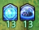

# UNDERSTANDING MY CO-HEALER
## **SAGE** - SPELLS YOU NEED TO KNOW

  [30s CD] **Kerachole**: 10% mitigation + low regen for 15s.

This is the staple for all raid damages, due to its double part regen, keep an eye out for it being used early before raid damage, as it can save you topping the group yourself.

  [60s CD] **Physis II**: Medium regen for 15s + 10% *action* healing buff for 10s.

Healing buff icon on the left, regen part on the right. It being healing *action* potency buff, it will only affect GCD healing, meaning most of the time you can forget this part. The regen is definitely potent however, so keep an eye out for it as it will have around 25% uptime.

  [120s CD] **Holos**: 10% mitigation for 20s + medium heal.

The 20s duration is the very unusual part about this skill. Very efficient on long mechanics with lots of repeat damage. The healing part means you don't have to top if you know your sage is gonna use it.

   [120s CD] **Panhaima**: 5 times self-reapplying low shield for 15s. Leftover shields heal based on stacks left.

Very useful for repeat mechanics, as above. Do not forget the healing part, as it will rarely ever use its five stacks in 15s.

 [120s CD] **Pneuma**: High to Very High burst healing.

Much harder for you to keep track of, however you should keep it in in mind as it comes to no DPS loss for the Sage and is *extremely* potent.

## **SCHOLAR** - SPELLS YOU NEED TO KNOW
> /!\ Under construction

## **ASTROLOGIAN** - SPELLS YOU NEED TO KNOW
> /!\ Under construction

## **WHITE MAGE** - SPELLS YOU NEED TO KNOW
> /!\ Under construction

---

# HOW TO PLAY AS A TEAM
## Raises & Limit Break
Raise priority rule of thumb:

        RDM > SMN > WHM > AST > SGE > SCH

Limit Break priority order rule of thumb:

        Regen Healer > Shield Healer

Order is determined by two factors: mana management and utility. Raising people is only useful if you can keep them alive. Using a GCD and a lot of mana / animation locking yourself for 8 seconds means you can't immediately heal, having a shield healer ready to mitigate while the other is busy is generally the best option.

## Healing
What you heal, the other doesn't have to; and conversely what you don't heal, the other has to. This might sound very obvious, but what that really means is, always use anything you can.

As a duo, you want to keep everyone *above 1HP* using as little GCD healing as possible, so try to use at least one cooldown per raid damage until you don't have any left. If that happens, then try to figure out whether or not you could have spared a cooldown somewhere. If you couldn't, then clench your teeth really hard and GCD heal. I reiterate : as long as your group survives, that's all that matters. Being 1 or 100% HP does not make a difference. You only need hp as a buffer for taking damage. Don't GCD heal if no one's gonna die.

On the other end of the spectrum, if there is too little damage and you sit on a spell for more than its total cooldown, sneak one use of it earlier. For example: if your first Physis II (60s CD) is at 1 minute 15, use it during your opener.
